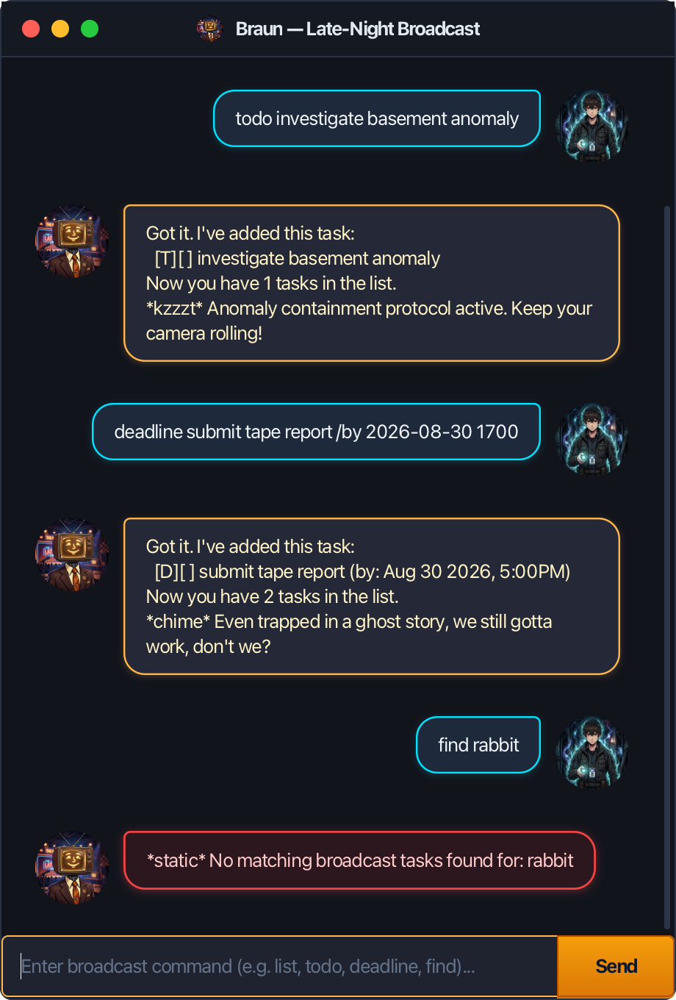

# Braun — User Guide

**Braun** is a desktop task and schedule manager styled with the retro-supernatural charm of a 1970s CRT TV-headed talk-show host (inspired by *Got Dropped into a Ghost Story, Still Gotta Work*). Whether you are cataloging field investigations, managing tight deadlines, or tracking scheduled events, Braun helps you stay organized through an interactive, responsive graphical interface and an alternate text-based console mode.

---

## Table of Contents
1. [Quick Start](#quick-start)
2. [User Interface Overview](#user-interface-overview)
3. [Command Format Notes](#command-format-notes)
4. [Features](#features)
   - [Adding a To-Do Task: `todo`](#1-adding-a-to-do-task-todo)
   - [Adding a Deadline Task: `deadline`](#2-adding-a-deadline-task-deadline)
   - [Adding an Event Task: `event`](#3-adding-an-event-task-event)
   - [Listing All Tasks: `list`](#4-listing-all-tasks-list)
   - [Marking a Task as Done: `mark`](#5-marking-a-task-as-done-mark)
   - [Unmarking a Task: `unmark`](#6-unmarking-a-task-as-not-done-unmark)
   - [Deleting a Task: `delete`](#7-deleting-a-task-delete)
   - [Finding Tasks: `find`](#8-finding-tasks-find)
   - [Querying Tasks by Date: `date`](#9-querying-tasks-by-date-date)
   - [Exiting the Application: `bye`](#10-exiting-the-application-bye)
5. [Data Persistence & Error Handling](#data-persistence--error-handling)
6. [Command Summary](#command-summary)

---

## Quick Start

1. Ensure you have **Java 25** (or Java 17+ with JavaFX installed) on your system.
2. Download the latest `braun.jar` release file.
3. Copy the file to the folder you want to use as the home directory for your tasks.
4. Open a terminal, navigate to that directory, and launch the application:
   ```bash
   java -jar braun.jar
   ```
5. A GUI window with Braun's broadcast channel will appear. Type your commands in the text box at the bottom and press **Enter** (or click **Send**) to execute them.

---

## User Interface Overview

Below is a snapshot of Braun in action, featuring retro CRT phosphor dialogs, responsive message wrapping, and crimson warning broadcasts:



- **Speech Bubbles**: Your commands appear on the right with the Explorer portrait; Braun's broadcast messages and lore remarks appear on the left.
- **Visual Alert Highlighting**: Unintentional command errors or broadcast static warnings are automatically highlighted with an electric crimson CRT border and warning background.
- **Focus Management**: The text input box automatically retains focus after each command for rapid keyboard-only typing.

---

## Command Format Notes

- **Case Sensitivity**: Command words (`todo`, `deadline`, `event`, `list`, `mark`, `unmark`, `delete`, `find`, `date`, `bye`) are case-insensitive (e.g. `LIST` and `list` work identically).
- **Parameters**: Words in `UPPER_CASE` indicate user-supplied parameters (e.g. in `todo DESCRIPTION`, `DESCRIPTION` is the description text).
- **Delimiters**: Required keyword delimiters start with a forward slash (e.g. `/by`, `/from`, `/to`).
- **Index Numbers**: Task index numbers refer to the positive integers shown in the `list` view (e.g. `1`, `2`, `3`).

---

## Features

### 1. Adding a To-Do Task: `todo`
Adds an unscheduled task without date or time constraints.

- **Format**: `todo DESCRIPTION`
- **Example**:
  ```text
  todo investigate basement anomaly
  ```
- **Output**:
  ```text
  Got it. I've added this task:
    [T][ ] investigate basement anomaly
  Now you have 1 tasks in the list.
  *kzzzt* Anomaly containment protocol active. Keep your camera rolling!
  ```

### 2. Adding a Deadline Task: `deadline`
Adds a task with a designated due date and optional time.

- **Format**: `deadline DESCRIPTION /by DATE_TIME`
- **Supported Date Formats**:
  - `yyyy-MM-dd HHmm` (e.g. `2026-08-30 1700`)
  - `d/M/yyyy HHmm` (e.g. `30/8/2026 1700`)
  - `yyyy-MM-dd` (e.g. `2026-08-30`)
  - `d/M/yyyy` (e.g. `30/8/2026`)
- **Example**:
  ```text
  deadline submit monthly report /by 2026-08-30 1700
  ```
- **Output**:
  ```text
  Got it. I've added this task:
    [D][ ] submit monthly report (by: Aug 30 2026, 5:00PM)
  Now you have 2 tasks in the list.
  *chime* Even trapped in a ghost story, we still gotta work, don't we?
  ```

### 3. Adding an Event Task: `event`
Adds a task spanning a specific start and end interval.

- **Format**: `event DESCRIPTION /from START_TIME /to END_TIME`
- **Notes**:
  - `START_TIME` and `END_TIME` support full dates or time-only strings (in which case the start date is inferred).
  - The start time must strictly precede the end time.
- **Example**:
  ```text
  event search pink rabbit doll /from 2026-08-24 1400 /to 2026-08-24 1600
  ```
- **Output**:
  ```text
  Got it. I've added this task:
    [E][ ] search pink rabbit doll (from: Aug 24 2026, 2:00PM to: Aug 24 2026, 4:00PM)
  Now you have 3 tasks in the list.
  *bzzzt* Reminds me of a certain charming pink rabbit doll, doesn't it?
  ```

### 4. Listing All Tasks: `list`
Displays all stored broadcast tasks with their task types (`[T]`, `[D]`, or `[E]`), completion statuses (`[X]` for done, `[ ]` for pending), and scheduled times.

- **Format**: `list`
- **Output**:
  ```text
  Here are the tasks in your list:
  1.[T][ ] investigate basement anomaly
  2.[D][ ] submit monthly report (by: Aug 30 2026, 5:00PM)
  3.[E][ ] search pink rabbit doll (from: Aug 24 2026, 2:00PM to: Aug 24 2026, 4:00PM)
  ```

### 5. Marking a Task as Done: `mark`
Marks an existing task in the schedule as completed.

- **Format**: `mark INDEX`
- **Example**: `mark 2`
- **Output**:
  ```text
  Nice! I've marked this task as done:
    [D][X] submit monthly report (by: Aug 30 2026, 5:00PM)
  ```

### 6. Unmarking a Task as Not Done: `unmark`
Reverts a completed task back to pending status.

- **Format**: `unmark INDEX`
- **Example**: `unmark 2`
- **Output**:
  ```text
  OK, I've marked this task as not done yet:
    [D][ ] submit monthly report (by: Aug 30 2026, 5:00PM)
  ```

### 7. Deleting a Task: `delete`
Removes a task permanently from the schedule.

- **Format**: `delete INDEX`
- **Example**: `delete 1`
- **Output**:
  ```text
  Noted. I've removed this task:
    [T][ ] investigate basement anomaly
  Now you have 2 tasks in the list.
  ```

### 8. Finding Tasks: `find`
Searches for tasks matching keywords, multi-word tokens, exact phrases, or dates.

- **Format**: `find KEYWORD [ADDITIONAL_KEYWORDS]...`
- **Search Capabilities**:
  - **Single Keyword**: Matches any task description containing the word (case-insensitive).
    - `find rabbit`
  - **Multi-Keyword OR Search**: Matches tasks containing any of the space-separated terms.
    - `find rabbit report` (matches both rabbit doll search and monthly report)
  - **Quoted Exact Phrase**: Matches the exact sequence of words inside quotes.
    - `find "pink rabbit"`
  - **Date & Schedule Search**: Finds tasks occurring on a formatted date or ISO date string.
    - `find Aug 24`
    - `find 2026-08-30`
- **Output Example**:
  ```text
  Here are the matching tasks in your list:
  1.[E][ ] search pink rabbit doll (from: Aug 24 2026, 2:00PM to: Aug 24 2026, 4:00PM)
  ```

### 9. Querying Tasks by Date: `date`
Filters and lists all tasks scheduled on a specific calendar day.

- **Format**: `date YYYY-MM-DD` (or `d/M/yyyy`)
- **Example**: `date 2026-08-24`
- **Output**:
  ```text
  Here are the tasks scheduled for Aug 24 2026:
  1.[E][ ] search pink rabbit doll (from: Aug 24 2026, 2:00PM to: Aug 24 2026, 4:00PM)
  ```

### 10. Exiting the Application: `bye`
Gracefully closes the application and saves all data.

- **Format**: `bye`
- **Output**:
  ```text
  *bzzzt* That's a wrap for today's broadcast!
  Bye. Hope to see you again soon!
  ```
- *Note: In GUI mode, the application window closes automatically after a 1.5-second farewell pause.*

---

## Data Persistence & Error Handling

- **Automatic Persistence**: All task modifications (`todo`, `deadline`, `event`, `mark`, `unmark`, `delete`) are automatically saved to `data/braun.txt`.
- **First-Run Resilience**: If `data/braun.txt` or the `data/` folder does not exist, Braun launches smoothly with an empty registry and creates the folder structure upon your first task addition.
- **Corrupted Data Protection**: If individual lines in the storage file become corrupted, Braun skips the faulty lines with a console warning and preserves all intact tasks.
- **Duplicate Prevention**: Braun guards against duplicate task entries. Adding a task with the exact same description and schedule will be rejected with an informative broadcast message.

---

## Command Summary

| Action | Command Format | Example |
| :--- | :--- | :--- |
| **Add To-Do** | `todo DESCRIPTION` | `todo investigate anomaly` |
| **Add Deadline** | `deadline DESCRIPTION /by DATE_TIME` | `deadline submit report /by 2026-08-30 1700` |
| **Add Event** | `event DESCRIPTION /from START /to END` | `event broadcast /from 2026-08-24 1400 /to 1600` |
| **List Tasks** | `list` | `list` |
| **Mark as Done** | `mark INDEX` | `mark 1` |
| **Unmark Task** | `unmark INDEX` | `unmark 1` |
| **Delete Task** | `delete INDEX` | `delete 2` |
| **Find (Keyword/Date)** | `find KEYWORD [KEYWORDS]...` | `find rabbit ghost`, `find "pink rabbit"` |
| **Filter by Date** | `date YYYY-MM-DD` | `date 2026-08-24` |
| **Exit** | `bye` | `bye` |